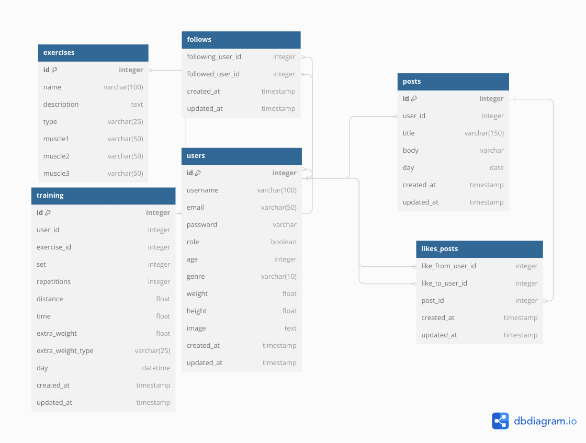

# Tu Gym Bro

## Stack del proyecto:
El backend del proyecto se construyo con *Nodejs*, *Express* y *Sequelize*. Mientras que el frontend del proyecto se construyo con *React*. El principal lenguaje de programación utilizado en la estructura de este proyecto es *Javascript*.

## Iniciar el proyecto:
Para iniciar el proyecto es necesario usar Nodejs versión 16.x.x y seguir los siguientes pasos:
1. Instalar los paquetes en las carpetas de **/server** y **/client** usando:
```
npm install
```
2. Iniciar el servidor y el cliente en las carpetas de **/server** y **/client** usando:
```
npm start
```

## Estructura de la base de datos:
