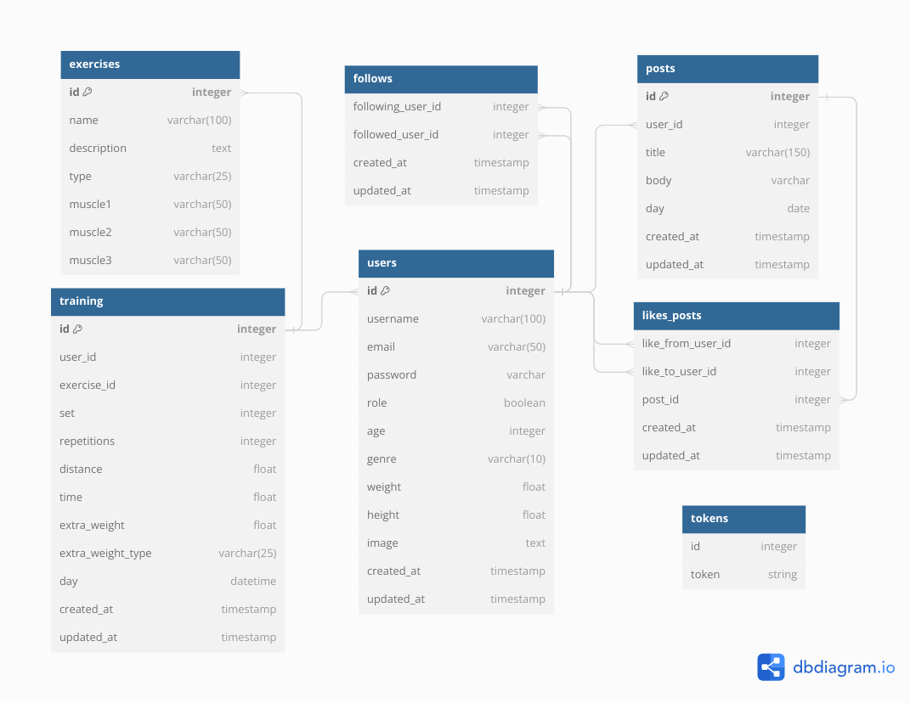

# Fit Partner

## Stack del proyecto:
El backend del proyecto se construyo con *Nodejs*, *Express* y *Sequelize*. Mientras que el frontend del proyecto se construyo con *React*. El principal lenguaje de programación utilizado en la estructura de este proyecto es *Javascript*. Para la base de datos se usó PostgreSQL.

## Iniciar el proyecto:
Para iniciar el proyecto es necesario usar Nodejs versión 16 y seguir los siguientes pasos:
1. Instalar Nodejs 16:
```
nvm install 16.20.2
nvm use 16.20.2
```
2. Instalar los paquetes en las carpetas de **/server** y **/client** usando:
```
npm install
```
3. Iniciar el servidor y el cliente en las carpetas de **/server** y **/client** usando:
```
npm run start
```

## Estructura de la base de datos:


## Version 1.0:
1. Se implementa una base de la aplicación con registro de usuarios e inicio de sesión usando [JWT](https://jwt.io/) (para mantener la sesión iniciada) y [bcrypt] (https://www.npmjs.com/package/bcrypt) (para encriptar las contraseñas).
2. Se crea el flujo de registro -> iniciar sesión -> cerrar sesión, tanto en el lado del servidor como en el lado de la interfaz de usuario. 
3. En el lado del client se puede acceder a la información de home solo si está autenticado el usuario.
4. Se necesita crear una validación en el client y en el server de los inputs de username, email y password.
5. Se necesita crear el flujo de recuperar contraseña enviando un correo con un link (usando tokens) para cambiar la contraseña.
6. Se incorporará css con tailwind para mejorar la interfaz de usuario en las pestañas de login, registro, recuperar contraseña e inicio.

## Version 2.0:
1. Se agregar la pantalla de carga mientras se esperan respuestas del server.

## Próximamente:
Lista de cosas por hacer:

1. Agregar vista de perfil con un formulario para editar la información
2. Se agrega la compatibilidad del home page en distintas resoluciones